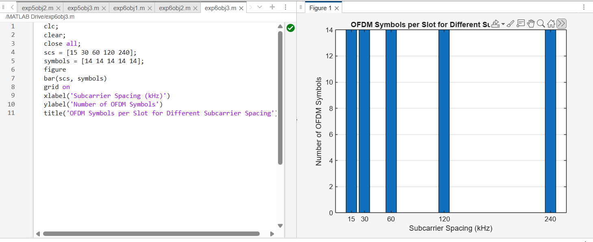

# Experient 6.3
## Code
```
clc; 
clear; 
close all; 
scs = [15 30 60 120 240];      
symbols = [14 14 14 14 14];    
figure 
bar(scs, symbols) 
grid on 
xlabel('Subcarrier Spacing (kHz)') 
ylabel('Number of OFDM Symbols') 
title('OFDM Symbols per Slot for Different Subcarrier Spacing') 
ylim([0 16])
...
```
## Output

