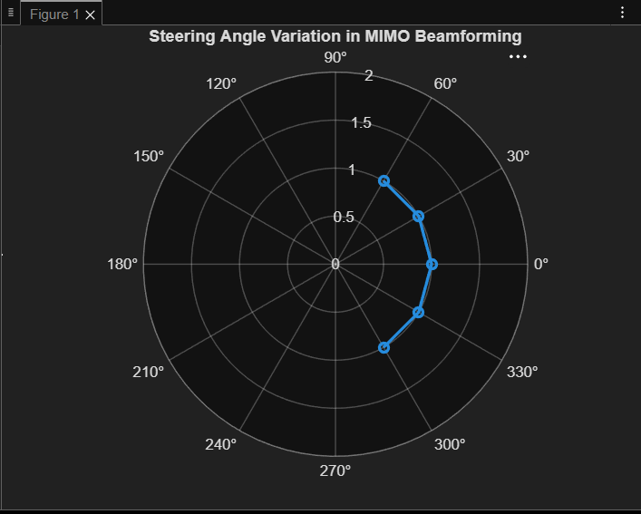

# Experiment 8.1
## Code
```Matlab
clc; 
clear; 
close all; 
angle = [-60 -30 0 30 60];    
gain = ones(size(angle));      
figure 
% Steering Angles (degrees) 
% Normalized Gain 
polarplot(deg2rad(angle), gain,'o-','LineWidth',2) 
title('Steering Angle Variation in MIMO Beamforming')
...
```
## Output

