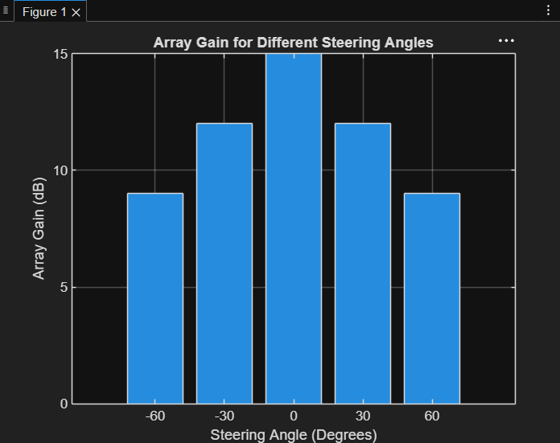

# Experiment 8.2
## Code
```Matlab
clc; 
clear; 
close all; 
angle = [-60 -30 0 30 60];      
gain = [9 12 15 12 9];          
figure 
bar(angle, gain) 
grid on 
xlabel('Steering Angle (Degrees)') 
ylabel('Array Gain (dB)') 
title('Array Gain for Different Steering Angles')
...
```
## Output

