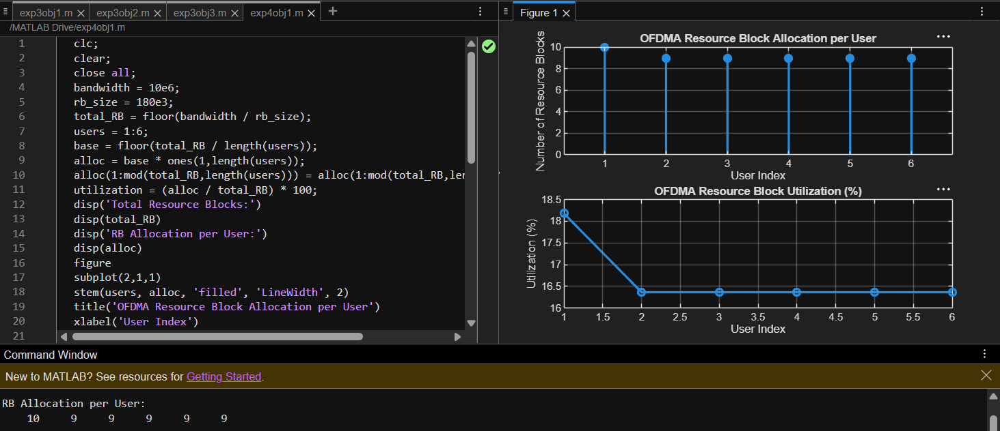

# Experiment 4.1
## Code
```Matlab
clc;
clear;
close all;
BW = 10;                
RB_BW = 180e-3;          
Total_RB = floor(BW/RB_BW);
Users = 1:5;
RB_Alloc = [12 10 9 8 11];

figure
subplot(2,1,1)
bar(Users,RB_Alloc)
title('OFDMA Resource Block Allocation')
xlabel('User Index')
ylabel('Allocated Resource Blocks')
grid on

subplot(2,1,2)
plot(Users,RB_Alloc,'-o','LineWidth',2)
title('Resource Block Allocation per User')
xlabel('User Index')
ylabel('Allocated Resource Blocks')
grid on
...
```
## Output


