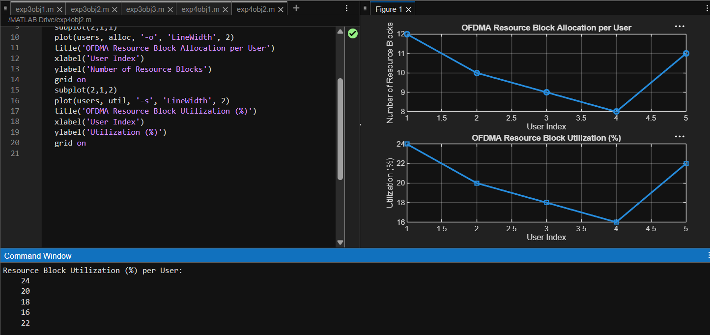

# Experiment 4.2
## Code
```Matlab
clc;
clear;
close all;

total_RB = 50;
users = 1:5;
alloc = [12 10 9 8 11];
util = (alloc/total_RB)*100;

figure
subplot(2,1,1)
plot(users,alloc,'-o','LineWidth',2)
title('OFDMA Resource Block Allocation per User')
xlabel('User Index')
ylabel('Number of Resource Blocks')
grid on

subplot(2,1,2)
plot(users,util,'-s','LineWidth',2)
title('OFDMA Resource Block Utilization (%)')
xlabel('User Index')
ylabel('Utilization (%)')
grid on
```
## Output

